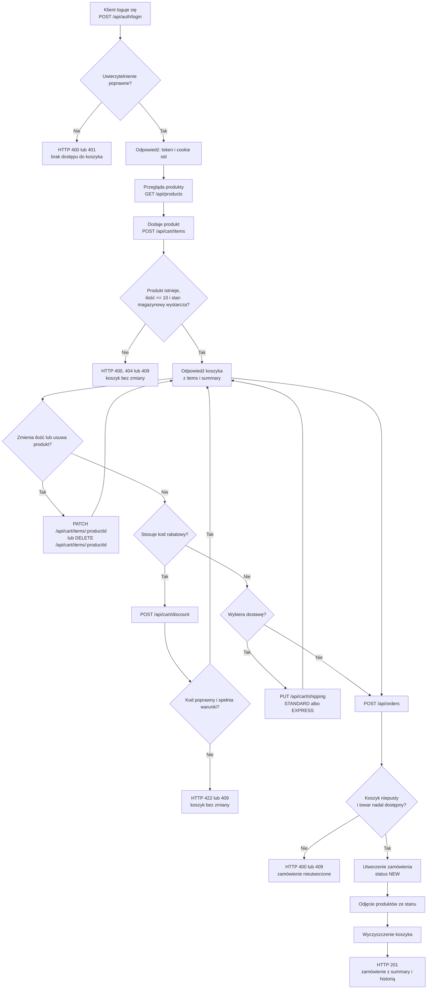

# Przepływ od dodania produktu do złożenia zamówienia

Diagram przedstawia przepływ API na podstawie `docs/architektura.md` oraz
implementacji w `src/routes/`.

## Źródła

- `docs/architektura.md`: kroki przepływu „złóż zamówienie”.
- `src/routes/auth.ts`: `authRouter.post('/login')`.
- `src/routes/products.ts`: `productsRouter.get('/')`.
- `src/routes/cart.ts`: `cartRouter.post('/items')`, `cartRouter.patch('/items/:productId')`,
  `cartRouter.delete('/items/:productId')`, `cartRouter.post('/discount')`,
  `cartRouter.put('/shipping')`, `cartView`.
- `src/routes/orders.ts`: `ordersRouter.post('/')`.

## Niezgodności z wymaganiami do uwzględnienia podczas testów

- **MOŻLIWY BŁĄD (BR-05):** wymagania mówią, że zastosowanie nowego kodu zastępuje
  poprzedni, natomiast `src/routes/cart.ts` odrzuca już zastosowany kod i pozwala
  przechowywać różne kody jednocześnie.
